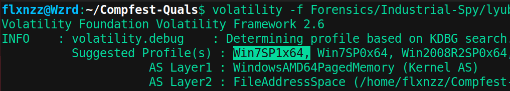
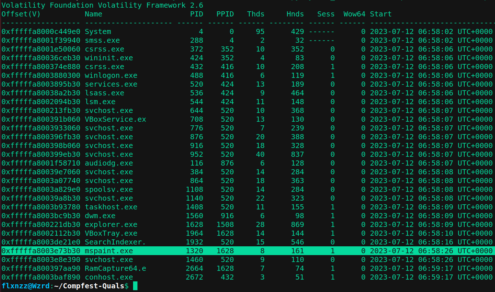
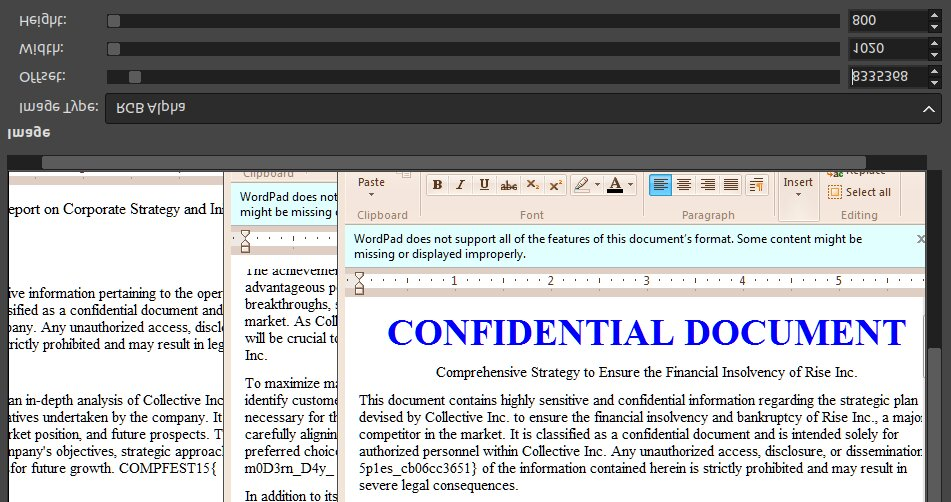
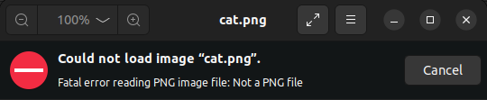
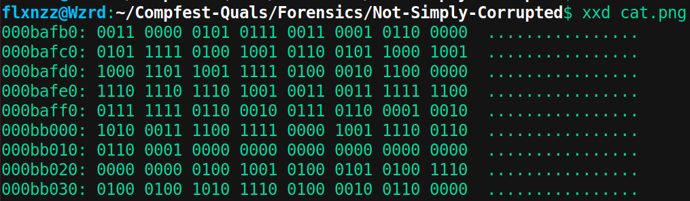
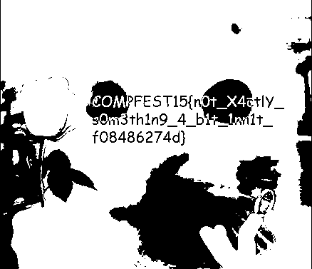


Here is a list of problems my team completed, you can download it in the PDF file above. Actually there are still **some challenges that have not been resolved** in the qualifying round. And **those are included in this `README.md` but excluded in PDF File**. And also, the COMPFEST CTF platform is currently down so i can't make Proof of Concept on some challenges.


# 1. Industrial Spy
*Author: k3ng*

Dear IT guy, I have suspicions that our graphic designer intern is stealing confidential documents and sending them to our competitor. I have sent her PC's memory dump to analyze.

Attachment: https://drive.google.com/file/d/18u8OSCejwV5Wo7Ezh7NLlVpuhkMQbw4d/view?usp=sharing

Hint 1: 8335370

## Solution
Diberikan sebuah memory dump berformat *.mem* . Lakukan analisis dengan Volatility (saya menggunakan versi 2). Namun sebelum menganalisis lebih lanjut, kita perlu tahu base profile yang digunakan pada memory dump ini agar bisa make plugin volatility lainnya.
```
volatility -f lyubov_20230712.mem imageinfo
```
Biasanya hasil yang muncul paling depan adalah yang paling match dengan memory dumpnya.



Setelah tau base profilenya, kita bisa menggunakan plugin volatility. Untuk menampilkan daftar proses yang sedang berjalan dalam snapshot memori, gunakan plugin `pslist`

```
volatility -f lyubov_20230712.mem --profile=Win7SP1x64 pslist
```


Proses yang berjalan tidak banyak sehingga tidak terlalu sulit untuk menganalisisnya. Berdasarkan deskripsi soal, orang yang mencurigakan bekerja sebagai desainer. Jadi saya mencari software yg berkaitan dengan desain pada process list di atas, dan ketemu `mspaint.exe` dengan PID 1320. Extract PID tersebut.

```
volatility -f lyubov_20230712.mem --profile=Win7SP1x64 memdump -p 1320 -D .
```

Setelah di extract, maka akan muncul file baru bernama `1320.dmp`. Ubah format file tsb menjadi `1320.data` agar bisa terbaca oleh GIMP. Disini kita perlu mengotak-atik value dari width, sedangkan untuk height bisa pakai 800 pixel saja sebagai permulaan.

Berdasarkan hint pada soal, terdapat nilai `8335370` yang ketika pertama kali saya lihat, saya tidak paham maksud hintnya. Namun nilai itu sebenarnya adalah offset gambarnya. Jadi intinya yang perlu kita cari tau adalah width imagenya. Berikut adalah settingan gambar hingga muncul flag.

```
Offset: 8335368
Width : 1020
Height: 800
```



# 2. Not Simply Corrupted
*Author: notnot*

My friend loves to send me memes that has cats in it! One day, he sent me another cat meme from his 4-bit computer, this time with “a secret”, he said. Unfortunately, he didn’t know sending the meme from his 4-bit computer sorta altered the image. Can you help me repair the image and find the secret?

## Solution


File attachment yang diberikan soal berformat .PNG. Dan jika dibuka, Gambar tersebut akan *corrupt* atau tidak terbaca oleh image viewer. Untuk itu, lihat isi hex dari file tsb dengan hex editor.



Terlihat bahwa header dan struktur dari PNG ini rusak, bahkan isinya hanya angka biner `0` dan `1`.  Setiap file PNG biasanya diawali oleh hex `89 50 4E 47 0D 0A 1A 0A` dan diakhiri oleh `00 00 00 00 49 45 4E 44 AE 42 60 82`. Karena isi dari file ini seluruhnya hanya angka `0` dan `1`, dan juga sesuai deskripsi pada soal, mungkin saja nilai biner ini merupakan hasil encoding dari hex.

Decode seluruh bilangan biner tersebut menjadi hex lalu simpan sebagai PNG. Hal ini bisa dilakukan dengan scripting python atau bisa juga dengan [tools online berikut](https://cryptii.com/pipes/binary-decoder) dan [Hexedit](https://hexed.it/). Maka akan didapat gambar kucing :


Tidak ada flag dalam gambar tersebut. Namun bisa jadi flagnya disembunyikan pada gambar tsbb dengan teknik steganography. Untuk memastikannya, saya menggunakan [tools online ini](https://www.aperisolve.com/), lalu didapat flag.



# 3. E2EBleed
*Author: rorre*

Someone in my house seems to be doing something fishy again… Maybe this time I will investigate. I’ve tapped into the connection of said person’s internet, perhaps you could help me find what they’re doing?

The (compiled) code and docker files required to run the set up locally are provided.

To deploy locally, simply run `docker compose up --build -d`. You can go to `http://localhost:444/` to access the site.

***NOTE***: Use `chall-olddocker.zip` if you use docker 20, if you have newer version, chall.zip should work just fine.

***Hint 1:*** Browser's devtools is an amazing tool. Maybe look at the source and network tab to figure things out?
***Hint 2:*** Try looking at the lifecycle of the chat, it's also using a common cryptography technique in CTF challenges.


## Solution
**Solved by: PwnEater**

Diberikan sebuah file pcap dan source code dari aplikasi (frontend dan backend). Pertama analisis terlebih dahulu file pcap, dan ditemukan app untuk berkomunikasi yang menggunakan websocket :


Terdapat 2 type data yang dikirimkan, pertama `v` dan `message`, kita cari tau bagaimana app menggunakan `message` dan `v` tersebut. ditemukan potongan source code sebagai berikut pada frontend yang telah dibuild :


  

Terlihat bahwa test yang akan ditampilkan di halaman chat akan proses pada fungsi `qp()` dengan parameter nilai Big Integer dari message terenskripsi, variable o yang berisi nilai eksponen `0x10001` dan nilai modulus n. Perumusan  Ke 3 parameter tersebut awalnya diperoleh dari potongan kode berikut :


  

Terdapat 2 kondisi, namun kita akan berfokus pada kondisi else untuk teks teks yang lebih panjang terlebih dulu. Implementasi ulang mekanisme tersebut dan copy juga seluruh fungsi yang berkaitan dengan prosesnya maka diperoleh kode sebagai berikut :

  
  


  

Run kode tersebut, namun dari pesan2 tersebut, tidak diperoleh flag :\


  
Ternyata **terdapat beberapa bagian paket yang di MASK**, berikut contohnya :  


Untuk mendapatkan key untuk xor data yg di mask sangat mudah, xor saja dengan key yang terdapat di paket data tersebut :


Run script tersebut dan diperoleh plain text nya :


Masukan cipher cipher tersebut ke solver script awal tadi maka diperoleh flag sebagai berikut :


