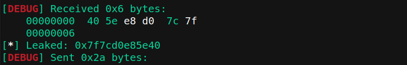

# List of Problems:

## Binary Exploitation

- [**Canary2Win** (162 pts)](#1-canary2win)
- [**ret2libc** (460 pts)](#2-ret2libc)
- [**ret2lib--c? i don't c it..** (484 pts)](#3-ret2lib--c-i-dont-c-it)
- [**Greetify** (100 pts)](#4-greetify)
-  [**Let's Jump** (469 pts)](#5-lets-jump)

## Cryptography

- [**Seems Familiar** (257 pts)](#6-seems-familiar)

## Forensic

- [**Intro to SysAdmin** (408 pts)](#7-intro-to-sysadmin)

## Reverse Engineering

- [**Serial Key** (100 pts)](#8-serial-key)
- [**baby JaSon adler** (116 pts)](#9-baby-jason-adler)


# 1. Canary2Win
*Author: NeoZap*

Mr. Ary is a professional and notorious stack smasher. I don't want to be a victim of Mr. Ary's shenanigans, so I added some protection to my binary and proudly said "Let's see if you can, Ary!". But alas, Mr. Ary still smashed my stack 😔. Can you too? Hopefully not that huge of a diff spike 🙏

    nc 34.101.174.85 10002


### Source Code Review
Terdapat kerentanan di fungsi `vuln()` pada source code yang diberikan. Kelemahan terletak pada `gets()` yang mana fungsi ini tidak mengecek seberapa banyak karakter yang masuk sehingga rentan terhadap buffer overflow. Lalu juga ada format string vulnerability pada fungsi `printf()`.

Inti dari tantangan ini adalah menggabungkan dua jenis kelemahan, yaitu: format string untuk membocorkan address canary dan buffer overflow untuk mengarahkan return address ke fungsi `win()`.  

Canary adalah nilai acak yang terletak di antara buffer dan return address. Jika canary berubah, program akan berhenti dan mengeluarkan pesan `***stack smashing detected***`. Walaupun tidak tampil langsung di source code, namun bisa dilihat saat di debug :


[Untuk lebih detailnya, cek artikel berikut](https://ir0nstone.gitbook.io/notes/types/stack/canaries).

### Case Identification
Cek proteksi/keamanan yang enabled pada file executable yang diberikan dengan `checksec`.

    Arch:     amd64-64-little
    RELRO:    Partial RELRO
    Stack:    Canary found
    NX:       NX enabled
    PIE:      No PIE (0x400000)
Ok, terlihat bahwa `Canary Found`. Jadi, tujuan pertama adalah untuk mendapatkan alamat canary. Dengan memanfaatkan format string vulnerability, kita dapat membaca isi dari stack. Nilai canary selalu random, tetapi pasti diakhiri dengan `00` dan tidak diawali dengan `f7` atau `ff`. 

Lalu setelah ketemu nilai canary, kita bisa mulai menyusun payload untuk overwrite return address menuju fungsi `win()`

### Solution
Script solver dapat dilihat [disini](PWN-canary2win/exploit.py). Script ini memanfaatkan format string untuk membaca isi dari stack. Address canary didapatkan melalui iterasi yang akan mengirim indeks format string dari 1 s.d. 50. Dari semua nilai yang diterima, program mencari nilai yang berakhir dengan "00" dan tidak dimulai dengan byte `0xf7` atau `0xff`.


Setelah menemukan nilai canary, selanjutnya adalah menyusun payload dan return to win!. Payload tersusun atas **padding + canary + padding + address win()**.


- Padding pertama: untuk memenuhi 32 byte variable buf + 8 byte padding. *(40 byte)*
- Canary : Canary yang telah dibocorkan sebelumnya *(8 byte)*.
- Padding kedua : untuk overwrite Saved RBP (nilai pointer yang akan dikembalikan ketika return).  *(8 byte)*
- Alamat target : alamat dari fungsi `win()`. *(8 byte)*


**Flag: COMPFEST15{fmtstr_to_leak_canary_bof_to_win__s4tsetsats3t}**

# 2. ret2libc
*Author: NeoZap*

Usual ret2libc.

Just maybe if you are having some trouble, this might be helpful to you: [https://ropemporium.com/guide.html#Common%20pitfalls](https://ropemporium.com/guide.html#Common%20pitfalls)

    nc 34.101.174.85 10007

### Source Code Review
Sama seperti sebelumnya, program ini menggunakan fungsi `gets()` dan `printf()` sehingga rentan terhadap buffer overflow dan format string vulnerability. 

Terdapat variabel `buf[1]` dan input user akan masuk ke fungsi `gets()`. Temukan offset dimana program akan overflow dengan `gdb`. Dalam hal ini program akan overflow ketika input melebihi 9 karakter, yang berarti 1 byte dari variable `buf` dan 8 bytes padding.


Namun kali ini tidak terlihat fungsi yang membuka file `flag.txt` atau semacamnya. Jadi, gimana kita menemukannya? Caranya adalah dengan return to libc (ret2libc). `libc` adalah komponen dasar dari banyak aplikasi di sistem UNIX dan Linux sehingga pasti file binary yang diberikan menggunakannya. Salah satu fungsi yang menjadi target pada soal kali ini adalah fungsi `system()`. Dengan menambah argumen `"/bin/sh"` kedalamnya, kita akan mendapatkan shell dan menemukan flag.

### Case Identification
Cek proteksi/keamanan yang enabled pada file executable yang diberikan dengan `checksec`.

    Arch:     amd64-64-little
    RELRO:    Partial RELRO
    Stack:    No canary found
    NX:       NX enabled
    PIE:      No PIE (0x3ff000)

Kali ini kita tidak perlu khawatir dengan Canary. Yang perlu diperhatikan adalah `NX enabled` yang berarti kita tidak bisa mengeksekusi shell/code pada stack. Namun dalam `ret2libc`, kita tidak mencoba untuk mengeksekusi kode pada stack. Sebaliknya, kita memanipulasi alamat return untuk menunjuk ke fungsi yang sudah ada dalam `libc`, yaitu `system()`. Karena `libc` berada di area memori yang dapat dieksekusi, kita dapat memanggil fungsi-fungsi di dalamnya tanpa masalah, meskipun NX aktif.

Selain itu juga proteksi PIE pada file binary terlihat disabled sehingga address fungsi akan tetap sama jika dijalankan berulang kali. Sebelum kita dapat memanfaatkan `libc`, kita perlu tahu di mana ia dimuat dalam memori. Namun karena kita ingin membocorkan alamat `libc` yang mana berada diluar file binary, berarti sama saja dengan mencari libc dalam mode ASLR aktif. [Cek artikel berikut.](https://tryhackme.com/room/ret2libc)

### Solution
Secara garis besar, urutan stepnya adalah sebagai berikut.

- Alamat fungsi dalam libc akan berbeda setiap kali program dijalankan. Jadi, kita perlu mencari tahu base address dari `libc`. Meskipun alamat ini random karena ada ASLR, kita dapat leak alamat fungsi dalam `libc` dengan memanggil  `printf` dengan argumen `printf@got.plt`. Nanti hasilnya adalah alamat dari `printf` dalam `libc`.

- Setelah dapat alamat `printf` dalam `libc`, kita dapat menghitung base address dari `libc` dengan mengurangkan offset `printf` dalam `libc` yang diketahui dari alamat bocor.

- Setelah kita memiliki base address dari `libc`, kita tahu alamat dari semua fungsi dalam `libc`. Dengan demikian, kita dapat membuat payload kedua yang mengubah return address untuk memanggil fungsi `system` dengan argumen string `/bin/sh`.

**[Berikut adalah script solver yang saya gunakan](PWN-canary2win/exploit.py)**, dan berikut adalah penjelasan solvernya.

**Payload Pertama**

- Payload pertama bertujuan untuk leak address `libc`
- Sebelum itu, kita perlu gadget `pop rdi ret` dan gadget `ret` dengan perintah :
```
ropper --file chall --search "pop rdi"
```
```
ropper --file chall --search "ret"
```
- Maka akan ketemu :


- Panggil `printf` dengan argumen `printf@got.plt`. Hal ini akan mencetak address dari `printf` dalam `libc` ke stdout.
- Gunakan instruksi `ret` untuk memastikan stack allignment untuk arsitektur x86_64 sesuai (16 byte) sebelum memanggil `printf`. [Cek artikel berikut](https://ropemporium.com/guide.html#Common%20pitfalls).
- Setelah mencetak alamat `printf`, jangan lupa kembali ke fungsi `main`. Berikut adalah address `printf` yang berhasil di leak.


**Menghitung Base Address dari libc**
 
Hitung base address dari `libc` dengan mengurangkan alamat `printf` yang sudah dileak sebelumnya dengan offset `printf` dalam `libc`.

    libc_base = leaked_printf - libc.sym.printf

**Payload Kedua**
    
- Payload kedua bertujuan untuk menggunakan informasi dari payload pertama untuk memanggil fungsi `system()` dengan argumen `"/bin/sh"`, sehingga mendapatkan shell.
- Dengan base address yg sudah di dapat pada variable `libc_base`, kita dapat menentukan address dari fungsi `system` dan lokasi string `/bin/sh` di dalam `libc`. Caranya adalah tinggal jumlahkan saja keduanya.
- Jangan lupa juga untuk menambahkan `ret` lagi untuk memastikan stack allignment sesuai, sebelum memanggil `system`.


**Flag: COMPFEST15{ret2libc_more_like_ret2libzy_peazy_lemon_squeezy}**

# 3. ret2lib--c? i don't c it..
*Author: NeoZap*

Same binary as ret2libc, but where is the libc? I don't see it..

*NOTE: The libc used in this challenge is different from the one in ret2libc.*

```
nc 34.101.174.85 10008
```

### Solution
Challenge ini mirip dengan yang sebelumnya (*bahkan source code dan binary filenya juga sama*), jadi saya skip bagian code review dan identifikasi kasus. Yang membedakan adalah kali ini kita tidak diberikan file `libc.so.6`. Jadi kita perlu mencari tahu sendiri versi libc yang digunakan oleh server agar perhitungan base address libc tepat.

Berikut adalah payload untuk leak address printf

```py
payload  =  flat({
offset: [
        pop_rdi,
        elf.got.printf,
        ret, # stack alignment
        elf.plt.printf,
        ret,
        elf.symbols.main
]
})
io.sendlineafter('>', payload)
io.recv()
```

```py
# Leaked printf addr
leaked_printf  =  unpack(io.recv()[:6].ljust(8, b"\x00"))
info("Leaked: %#x", leaked_printf)
```


    
Setelah tau address fungsi `printf`, kita bisa mengetahui versi libc pada server. Copy 3 bytes terakhir dari leaked printf address ke url berikut : https://libc.blukat.me/ maka akan didapatkan


Lihat tabel bagian Offset pada web tersebut, value itu yang akan kita pakai untuk menghitung `libc base address`, `/bin/sh`, dan address `system`. Step selanjutnya sama persis dengan soal sebelumnya.

**[Berikut adalah script solver yang saya gunakan](PWN-canary2win/exploit.py)**


# 4. Greetify
*Author: NeoZap*

Because I'm feeling lonely, I made an application to greet me. But I'm sure that I'm not the only one who's lonely, so I made it in a way that it can greet anyone. However, I'm not sure if it's safe to use. Can you help me check it?

Flag is at `flag.txt`

`nc 34.101.174.85 10001`

### Source Code Review
Di sini, program mendeklarasikan array `name` dengan panjang 88 byte, lalu menggunakan `gets()` untuk membaca input pengguna ke dalam `name`. Karena `gets()` tidak melakukan pengecekan panjang, pengguna dapat memasukkan lebih dari 88 byte data, yang akan menimpa data di memori yang berdekatan

### Case Identification
Lihat proteksi yang nyala pada file binary dengan `checksec`

    Arch:     amd64-64-little
    RELRO:    Full RELRO
    Stack:    No canary found
    NX:       NX enabled
    PIE:      PIE enabled
Karena tidak ada stack canary, langsung saja lakukan overflow ke programnya.

### Solution
Pada source code, terlihat bahwa variabel `name` menyimpan buffer sebanyak 88 byte. Jadi kita akan melakukan overflow sebanyak 96 bytes karakter + string `flag.txt`. 96 karakter didapat dari ukuran variable `name` dan 8 bytes padding. Berikut adalah solvernya :

    python2 -c "print 'A'*96 + 'flag.txt'" | nc 34.101.174.85 10001


# 5. Lets Jump
To be added soon.

# 6. Seems Familiar
*Author: potsu*

Your friend has developed an AES-based enryption system in his spare time. That system is very limited and only able to use printable characters, and furthermore, two of four of its functions has yet to be fixed. Even though they are broken, he insisted the flag can be acquired through thorough analysis of the encryption itself. Feeling intrigued, you feel like you are able to get the flag.

`nc 34.101.174.85 10000`

### Source Code Review
Berdasarkan source code yang diberikan pada soal, enkripsi yang digunakan pada script ini adalah AES mode ECB. File ini memiliki fungsi `encrypt` yang mengenkripsi input user dan mencetak hasil cipher teks dalam bentuk hex. Fungsi `decrypt` dalam skrip ini tidak berfungsi, dan terdapat fungsi `get_flag` yang juga tidak berfungsi. Jadi, satu-satunya opsi yang bisa dipilih adalah opsi nomor 2, yaitu `Encrypt a message`.

Dari analisis skrip, kita tahu bahwa pesan dienkripsi dalam blok-blok 16 byte (128 bit) menggunakan mode ECB. Oleh karena itu, kita dapat menguraikan cipher teks ke dalam blok-blok 16 byte dan mencoba mendekripsi setiap blok secara terpisah.


### Case Identification
-   Dalam mode ECB, setiap blok teks asli dienkripsi secara independen dengan kunci yang sama.
-   Kerentanan utama terletak pada penggunaan mode ECB. Dalam mode ECB, setiap blok teks asli dienkripsi secara independen dengan kunci yang sama. Oleh karena itu, dua blok teks asli yang sama akan menghasilkan blok cipher teks yang sama jika dienkripsi dengan kunci yang sama. 
- Jadi, mode ini rentan terhadap serangan bruteforce.

### Solution
Karena setiap blok dienkripsi secara independen, kita dapat mengirimkan berbagai kombinasi karakter ke server dan membandingkan blok cipher teks yang dihasilkan dengan blok cipher teks target. Idenya adalah :
-   Untuk setiap karakter yang dikirimkan, kita bandingkan blok cipher teks yang dihasilkan dengan blok cipher teks target.
-   Jika blok cocok, maka karakter yang dikirimkan adalah bagian dari flag, dan proses ini diulangi untuk karakter berikutnya, sampai seluruh flag ketemu.

**[Berikut adalah script solver yang saya gunakan](Crypto-SeemsFamiliar/decrypt.py)**


# 7. Intro to SysAdmin
*Author: rorre*

Welcome to the world of sysadmin! Our postgresql server was hacked, can you check out what's happening here?

Requirements:

-   A linux system! VM or WSL (should) work too

### Setting up Environment
1. Extract attachment yang diberikan soal sebagai root

```
sudo tar -xf debian.tar.gz
```

3. Set up environment variable

```
export DEBROOT=$PWD/debian
``` 

5. Cek environment variable

```
echo $DEBROOT
```

7. Mount file system

```
mount -v --bind /dev "$DEBROOT"/dev
mount -v --bind /dev/pts "$DEBROOT"/dev/pts
mount -vt proc proc "$DEBROOT"/proc
mount -vt sysfs sysfs "$DEBROOT"/sys
mount -vt tmpfs tmpfs "$DEBROOT"/run
```

9. Change root
```
chroot "$DEBROOT" /usr/bin/env -i   \
    HOME=/root                      \
    TERM="$TERM"                    \
    PS1='(root chroot) \u:\w\$ '    \
    PATH=/usr/bin:/usr/sbin         \
    /bin/bash --login
```


### Solution
*(TO-DO)*


# 8. Serial Key
*Author: prajnapras19*

Classic reverse, classic serial key

```
nc 34.101.174.85 10003
```

### Source Code Review
Hanya diberikan file binary tanpa source code, Jadi silakan decompile sendiri menggunakan `Ghidra` atau decompiler lainnya. Terdapat dua user defined function, yaitu fungsi `main()` dan fungsi `check()`. Informasi yang didapatkan berdasarkan fungsi `check` :
- Panjang serial key adalah 24 karakter
- Jika panjang param_1 adalah 24 karakter, maka fungsi memeriksa apakah karakter ke-5, ke-10, ke-15 adalah '-'. Jika salah satu dari karakter tersebut bukan '-', maka fungsi mengembalikan 0.
- Setiap key yang valid akan dicek terhadap setiap key valid sebelumnya melalui serial dan idx, dan apabila sudah ada sebelumnya, akan ditolak.
- Jika semua pemeriksaan di atas dilewati, maka param_1 ditambahkan ke daftar serial yang valid dan idx ditambahkan dengan 1. Fungsi kemudian mengembalikan 1, yang berarti param_1 adalah serial key yang valid.

Serial key akan selalu mengikuti format `XXXX-XXXX-XXXX-XXXX-XXXX` dimana X adalah karakter alphanumeric. **Intinya**, berdasarkan fungsi `main`,  flag akan muncul jika kita berhasil membuat 100 key unik yang beda dari key sebelumnya.


### Solution
Berdasarkan informasi di atas, contoh serial key yang valid adalah :
- AAAA-BBBB-CCCC-DDDD-EEEE 
- BBBB-AAAA-CCCC-DDDD-EEEE 
- BBBB-CCCC-AAAA-DDDD-EEEE 
- BBBB-CCCC-DDDD-AAAA-EEEE

Hal ini akan mudah jika dibuat automasi dengan script python. **[Berikut adalah script solver yang saya gunakan](Reversing-SerialKey/serial.py)**

# 9. baby JaSon adler
*Author: Lily*

Most people say that babies are hard to understand. But that’s not the case for baby Jason. everyone can understand him easily.

### Source Code Review
Diberikan 2 file : `enc.txt` dan `adler`.  Isi dari enc.txt adalah yang akan kita decrypt untuk mendapatkan flag : 

    D“àİŶƻȎɢʓˈ̓͸ϚлѯҧӝՀո֩؍قٶگܒݴޭߣࠗࡼࢰऒॆॻমৢੈભଐୄ୵ப௟ు౳೔ആഺ൬ිชฺຝ໔༈ཫྡဃံၧႝᄃᄹᅱᆤሊቁእዖገጽ᎟᐀ᐳᑩᓦD×ųȐʦ̱ωѰӵ՛؋ڻݒࠕࢪख঄ਝસଡஶ౏ಸഥශຆ༡ྐ࿺႓ᄬᇂቘ዁ጩ᎐ᐪᓵᖽᙔᚹᜟញᠠᢴ᥇᧚ᩀ᪦ᬾᯜ᱄᳗ᵱᷜṳἌᾤ‹₝℄↠∼⊪⌕⎮⑋ⓦ╻◞♅⛜➟⠳⢜⥏

Lalu untuk file `adler`, Copy code pada file file tersebut ke [JavaScript beautifier](https://beautifier.io/), maka akan terlihat kode JavaScript yang mengenkripsi flag.
```js
enc = [];
holder1 = [];
holder2 = [];
fl4g.split("").map((x, y) => {
!y ? holder1[y] = x.charCodeAt(0) + 1 : holder1[y] = ((x.charCodeAt(0) + holder1[y - 1]) % (2 ** 9 << 16))
});
holder1.map((zZ, hh) => {
!hh ? holder2[hh] = holder1[hh] : holder2[hh] = (zZ + holder1[hh - 1]) % (2 ** 9 << 8)
});
enc = holder1.concat(holder2);
enc.map((wkwk, zz) => {
enc[zz] = String.fromCharCode(wkwk)
});
enc = enc.join("")
```

Ada beberapa operasi yang terlibat, yaitu operasi XOR dan perubahan nilai ASCII. Kode ini menghasilkan teks terenkripsi yang disimpan dalam file `enc.txt`.


### Case Identification
Kerentanannya terletak pada cara `holder1` dihitung. Karena `h1` adalah hasil dari operasi XOR antara kode ASCII dari setiap karakter dari flag dan indeks karakter tersebut, kita dapat melakukan operasi sebaliknya untuk mendapatkan kode ASCII asli dari nilai `h1`.

### Solution
Cara yang saya lakukan adalah mengubah algoritma enkripsi dari JavaScript ke Python.

**[Berikut adalah script solver yang saya gunakan](Reversing-jasonAdler/decrypt.py)**

Script ini mengenkripsi setengah pertama dari `enc_text` dan membandingkan hasilnya dengan `enc_text` untuk memastikan bahwa algoritma tersebut benar.

Jika hasil enkripsi sama dengan `enc_text`, maka kita dapat menggunakan algoritma dekripsi yang merupakan kebalikan dari algoritma enkripsi untuk mendecrypt `enc_text`.


