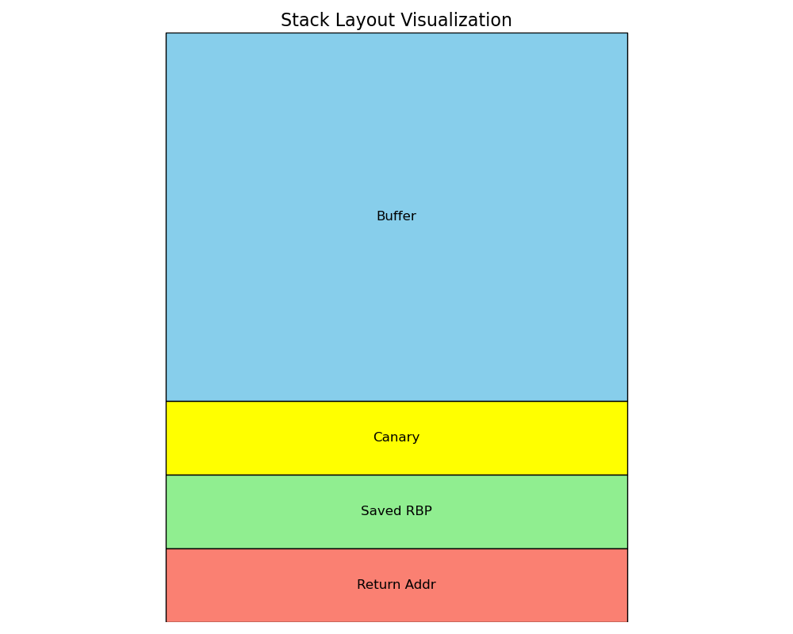

# Binary Exploitation

## Canary2Win
Mr. Ary is a professional and notorious stack smasher. I don't want to be a victim of Mr. Ary's shenanigans, so I added some protection to my binary and proudly said "Let's see if you can, Ary!". But alas, Mr. Ary still smashed my stack 😔. Can you too? Hopefully not that huge of a diff spike 🙏 

*nc 34.101.174.85 10002 
Author: NeoZap*

### Source Code Review
Terdapat kerentanan di fungsi `vuln()` pada source code yang diberikan. Kelemahan terletak pada `gets()` yang mana fungsi ini tidak mengecek seberapa banyak karakter yang masuk sehingga rentan terhadap buffer overflow. Lalu juga ada format string vulnerability pada fungsi `printf()`.

Inti dari tantangan ini adalah menggabungkan dua jenis kelemahan, yaitu: format string untuk membocorkan address canary dan buffer overflow untuk mengarahkan return address ke fungsi `win()`.  

Canary adalah nilai acak yang terletak di antara buffer dan return address. Jika canary berubah, program akan berhenti dan mengeluarkan pesan `***stack smashing detected***`. Walaupun tidak tampil langsung di source code, namun bisa dilihat saat di decompile :

[Untuk lebih detailnya, cek artikel berikut](https://ir0nstone.gitbook.io/notes/types/stack/canaries).

### Case Identification
Cek proteksi/keamanan yang enabled pada file executable yang diberikan dengan `checksec`.

    Arch:     amd64-64-little
    RELRO:    Partial RELRO
    Stack:    Canary found
    NX:       NX enabled
    PIE:      No PIE (0x400000)
Ok, terlihat bahwa `Canary Found`. Jadi, tujuan pertama adalah untuk mendapatkan alamat canary. Dengan memanfaatkan format string vulnerability, kita dapat membaca isi dari stack. Nilai canary selalu random, tetapi pasti diakhiri dengan `00` dan tidak diawali dengan `f7` atau `ff`. 

Lalu setelah ketemu nilai canary, kita bisa mulai menyusun payload untuk overwrite return address menuju fungsi `win()`

### Solution
Script solver dapat dilihat [disini](PWN-canary2win/exploit.py). Script ini memanfaatkan format string untuk membaca isi dari stack. Address canary didapatkan melalui iterasi yang akan mengirim indeks format string dari 1 s.d. 50. Dari semua nilai yang diterima, program mencari nilai yang berakhir dengan "00" dan tidak dimulai dengan byte `0xf7` atau `0xff`.

Setelah menemukan nilai canary, selanjutnya adalah menyusun payload dan return to win!. Payload tersusun atas **padding + canary + padding + address win()**.

- Padding pertama: untuk memenuhi 32 byte variable buf + 8 byte padding. *(40 byte)*
- Canary : Canary yang telah dibocorkan sebelumnya *(8 byte)*.
- Padding kedua : untuk overwrite Saved RBP (nilai pointer yang akan dikembalikan ketika return).  *(8 byte)*
- Alamat target : alamat dari fungsi `win()`. *(8 byte)*

**Flag: COMPFEST15{fmtstr_to_leak_canary_bof_to_win__s4tsetsats3t}**

