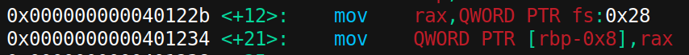
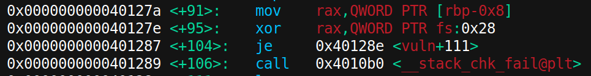
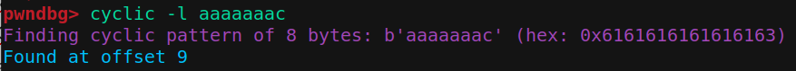
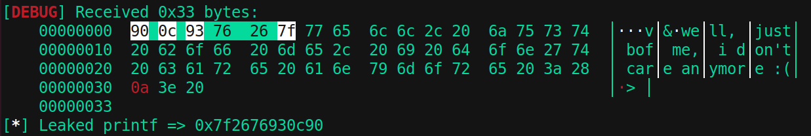
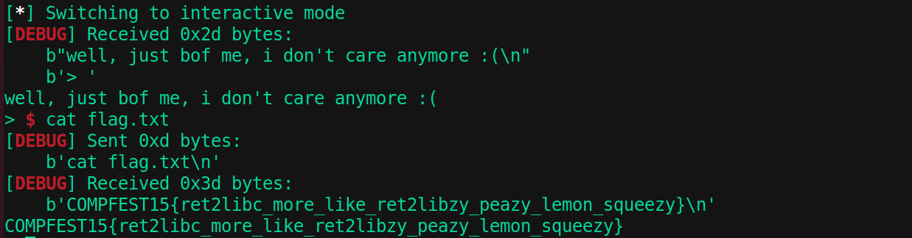

# Binary Exploitation

## Canary2Win
**Author: NeoZap**
Mr. Ary is a professional and notorious stack smasher. I don't want to be a victim of Mr. Ary's shenanigans, so I added some protection to my binary and proudly said "Let's see if you can, Ary!". But alas, Mr. Ary still smashed my stack 😔. Can you too? Hopefully not that huge of a diff spike 🙏 

    nc 34.101.174.85 10002

### Source Code Review
Terdapat kerentanan di fungsi `vuln()` pada source code yang diberikan. Kelemahan terletak pada `gets()` yang mana fungsi ini tidak mengecek seberapa banyak karakter yang masuk sehingga rentan terhadap buffer overflow. Lalu juga ada format string vulnerability pada fungsi `printf()`.

Inti dari tantangan ini adalah menggabungkan dua jenis kelemahan, yaitu: format string untuk membocorkan address canary dan buffer overflow untuk mengarahkan return address ke fungsi `win()`.  

Canary adalah nilai acak yang terletak di antara buffer dan return address. Jika canary berubah, program akan berhenti dan mengeluarkan pesan `***stack smashing detected***`. Walaupun tidak tampil langsung di source code, namun bisa dilihat saat di decompile :

[Untuk lebih detailnya, cek artikel berikut](https://ir0nstone.gitbook.io/notes/types/stack/canaries).

### Case Identification
Cek proteksi/keamanan yang enabled pada file executable yang diberikan dengan `checksec`.

    Arch:     amd64-64-little
    RELRO:    Partial RELRO
    Stack:    Canary found
    NX:       NX enabled
    PIE:      No PIE (0x400000)
Ok, terlihat bahwa `Canary Found`. Jadi, tujuan pertama adalah untuk mendapatkan alamat canary. Dengan memanfaatkan format string vulnerability, kita dapat membaca isi dari stack. Nilai canary selalu random, tetapi pasti diakhiri dengan `00` dan tidak diawali dengan `f7` atau `ff`. 

Lalu setelah ketemu nilai canary, kita bisa mulai menyusun payload untuk overwrite return address menuju fungsi `win()`

### Solution
Script solver dapat dilihat [disini](PWN-canary2win/exploit.py). Script ini memanfaatkan format string untuk membaca isi dari stack. Address canary didapatkan melalui iterasi yang akan mengirim indeks format string dari 1 s.d. 50. Dari semua nilai yang diterima, program mencari nilai yang berakhir dengan "00" dan tidak dimulai dengan byte `0xf7` atau `0xff`.

Setelah menemukan nilai canary, selanjutnya adalah menyusun payload dan return to win!. Payload tersusun atas **padding + canary + padding + address win()**.

- Padding pertama: untuk memenuhi 32 byte variable buf + 8 byte padding. *(40 byte)*
- Canary : Canary yang telah dibocorkan sebelumnya *(8 byte)*.
- Padding kedua : untuk overwrite Saved RBP (nilai pointer yang akan dikembalikan ketika return).  *(8 byte)*
- Alamat target : alamat dari fungsi `win()`. *(8 byte)*

**Flag: COMPFEST15{fmtstr_to_leak_canary_bof_to_win__s4tsetsats3t}**

## ret2libc
**Author: NeoZap**

Usual ret2libc.

Just maybe if you are having some trouble, this might be helpful to you: [https://ropemporium.com/guide.html#Common%20pitfalls](https://ropemporium.com/guide.html#Common%20pitfalls)

    nc 34.101.174.85 10007

### Source Code Review
Sama seperti sebelumnya, program ini menggunakan fungsi `gets()` dan `printf()` sehingga rentan terhadap buffer overflow dan format string vulnerability. 

Terdapat variabel `buf[1]` dan input user akan masuk ke fungsi `gets()`. Temukan offset dimana program akan overflow dengan `gdb`. Dalam hal ini program akan overflow ketika input melebihi 9 karakter, yang berarti 1 byte dari variable `buf` dan 8 bytes padding.

Namun kali ini tidak terlihat fungsi yang membuka file `flag.txt` atau semacamnya. Jadi, gimana kita menemukannya? Caranya adalah dengan return to libc (ret2libc). `libc` adalah komponen dasar dari banyak aplikasi di sistem UNIX dan Linux sehingga pasti file binary yang diberikan menggunakannya. Salah satu fungsi yang menjadi target pada soal kali ini adalah fungsi `system()`. Dengan menambah argumen `"/bin/sh"` kedalamnya, kita akan mendapatkan shell dan menemukan flag.

### Case Identification
Cek proteksi/keamanan yang enabled pada file executable yang diberikan dengan `checksec`.

    Arch:     amd64-64-little
    RELRO:    Partial RELRO
    Stack:    No canary found
    NX:       NX enabled
    PIE:      No PIE (0x3ff000)

Kali ini kita tidak perlu khawatir dengan Canary. Yang perlu diperhatikan adalah `NX enabled` yang berarti kita tidak bisa mengeksekusi shell/code pada stack. Namun dalam `ret2libc`, kita tidak mencoba untuk mengeksekusi kode pada stack. Sebaliknya, kita memanipulasi alamat return untuk menunjuk ke fungsi yang sudah ada dalam `libc`, yaitu `system()`. Karena `libc` berada di area memori yang dapat dieksekusi, kita dapat memanggil fungsi-fungsi di dalamnya tanpa masalah, meskipun NX aktif.

Selain itu juga proteksi PIE pada file binary terlihat disabled sehingga address fungsi akan tetap sama jika dijalankan berulang kali. Sebelum kita dapat memanfaatkan `libc`, kita perlu tahu di mana ia dimuat dalam memori. Namun karena kita ingin membocorkan alamat `libc` yang mana berada diluar file binary, berarti sama saja dengan mencari libc dalam mode ASLR aktif. [Cek artikel berikut.](https://tryhackme.com/room/ret2libc)

### Solution
Secara garis besar, urutan stepnya adalah sebagai berikut.

- **Langkah 1:** Alamat fungsi dalam libc akan berbeda setiap kali program dijalankan. Jadi, kita perlu mencari tahu base address dari `libc`. Meskipun alamat ini random karena ada ASLR, kita dapat leak alamat fungsi dalam `libc` dengan memanggil  `printf` dengan argumen `printf@got.plt`. Nanti hasilnya adalah alamat dari `printf` dalam `libc`.

- **Langkah 2:** Setelah dapat alamat `printf` dalam `libc`, kita dapat menghitung base address dari `libc` dengan mengurangkan offset `printf` dalam `libc` yang diketahui dari alamat bocor.

- **Langkah 3:** Setelah kita memiliki base address dari `libc`, kita tahu alamat dari semua fungsi dalam `libc`. Dengan demikian, kita dapat membuat payload kedua yang mengubah return address untuk memanggil fungsi `system` dengan argumen string `/bin/sh`.

**[Berikut adalah script solver yang saya gunakan](PWN-canary2win/exploit.py)**, dan berikut adalah penjelasan solvernya.

**Payload Pertama**

- Payload pertama bertujuan untuk leak address `libc`
- Panggil `printf` dengan argumen `printf@got.plt`. Hal ini akan mencetak address dari `printf` dalam `libc` ke stdout.
- Gunakan instruksi `ret` untuk memastikan stack allignment untuk arsitektur x86_64 sesuai (16 byte) sebelum memanggil `printf`. [Cek artikel berikut](https://ropemporium.com/guide.html#Common%20pitfalls).
- Setelah mencetak alamat `printf`, jangan lupa kembali ke fungsi `main`. Berikut adalah address `printf` yang berhasil di leak.

**Menghitung Base Address dari libc**
 
Hitung base address dari `libc` dengan mengurangkan alamat `printf` yang sudah dileak sebelumnya dengan offset `printf` dalam `libc`.

    libc_base = leaked_printf - libc.sym.printf

**Payload Kedua**
    
- Payload kedua bertujuan untuk menggunakan informasi dari payload pertama untuk memanggil fungsi `system()` dengan argumen `"/bin/sh"`, sehingga mendapatkan shell.
- Dengan base address yg sudah di dapat pada variable `libc_base`, kita dapat menentukan address dari fungsi `system` dan lokasi string `/bin/sh` di dalam `libc`. Caranya adalah tinggal jumlahkan saja keduanya.
- Jangan lupa juga untuk menambahkan `ret` lagi untuk memastikan stack allignment sesuai, sebelum memanggil `system`.

**Flag: COMPFEST15{ret2libc_more_like_ret2libzy_peazy_lemon_squeezy}**
